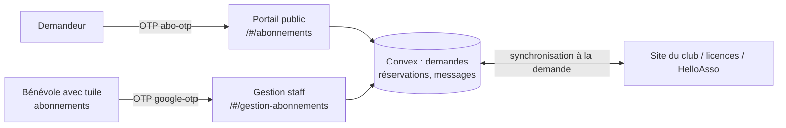
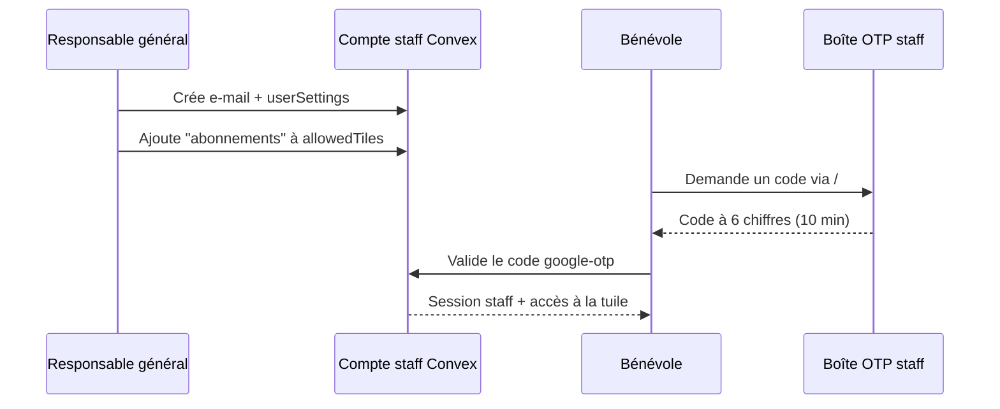
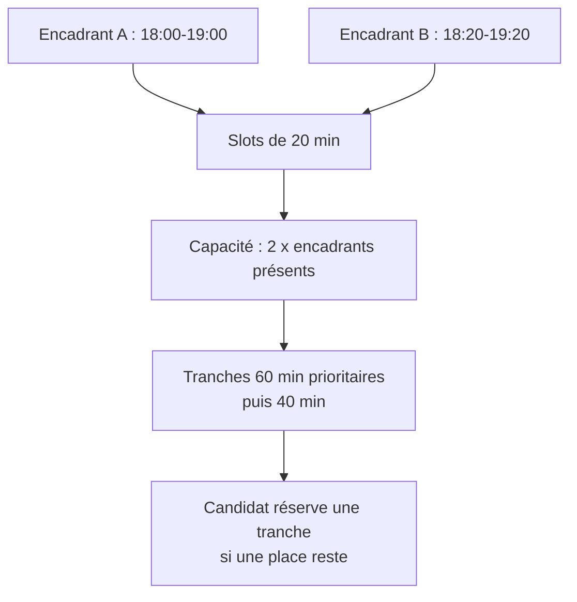
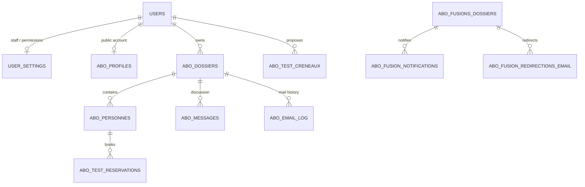

# Audit fonctionnel — Abonnements escalade

> **Statut :** rétro-ingénierie du code au 4 août 2026. Ce document décrit ce
> que l'application fait réellement, pas seulement ce qu'elle est censée faire.
> Il est destiné aux responsables du club et aux bénévoles qui préparent la mise
> en service. Les constats à arbitrer sont regroupés à la fin.

## 1. À quoi sert cette tuile ?

La tuile **Abonnements escalade** gère les nouvelles demandes d'accès aux
créneaux d'escalade autonome. Elle accompagne une personne de sa demande
initiale jusqu'aux démarches finales : licence CAF, inscription sur le site du
club, paiement, et, si nécessaire, test d'autonomie.

Elle ne remplace pas le site du club ni HelloAsso. Elle sert de **portail de
suivi et de coordination** entre le demandeur, les bénévoles et ces services
externes.

Deux espaces complètement séparés cohabitent :

| Personne | Espace | Ce qu'elle peut faire |
|---|---|---|
| Demandeur / futur abonné | `/#/abonnements` | Créer et suivre sa demande, discuter avec le club, réserver ou annuler un test. |
| Bénévole habilité Abonnements | `/#/gestion-abonnements` | Instruire les dossiers, proposer des tests, gérer les données de référence et la configuration. |
| Administrateur général sans tuile Abonnements | Configurations seulement | Gérer les comptes staff, mais **pas** gérer les abonnements. |



## 2. Vocabulaire utile

| Terme | Signification concrète |
|---|---|
| **Staff** | Bénévole interne, dont l'adresse e-mail a été créée au préalable dans Configurations. |
| **Tuile `abonnements`** | Permission précise donnant le droit de gérer ce module. C'est elle qui fait l'« admin Abonnements ». |
| **Admin général** | Rôle qui permet de gérer les utilisateurs et les saisons dans Configurations. Il ne donne pas accès aux abonnements par lui-même. |
| **Dossier** | Demande portée par une adresse e-mail ; un dossier peut contenir plusieurs personnes. |
| **Personne** | Chaque candidat figurant dans un dossier ; les décisions et les étapes sont suivies par personne. |
| **Vague** | Période d'ouverture des demandes, avec priorité aux élèves déjà inscrits aux cours en vague 2. |
| **Créneau de disponibilité** | Plage proposée par un encadrant. Plusieurs encadrants peuvent proposer la même plage. |
| **Tranche de test** | Rendez-vous réservable de 40 ou 60 min, calculé à partir des disponibilités cumulées. |

## 3. Comment un bénévole devient administrateur Abonnements

Il n'existe pas d'inscription libre pour le staff. Un administrateur général
doit effectuer la préparation suivante ; c'est le parcours à utiliser pour une
personne qui devra proposer des tests.

1. Se connecter au portail staff avec son propre compte et ouvrir
   **Configurations > Utilisateurs et Accès**.
2. Cliquer sur **Ajouter un utilisateur**, saisir le nom et l'adresse e-mail
   professionnelle ou personnelle du bénévole, puis enregistrer.
3. Éditer ensuite cet utilisateur et cocher explicitement la permission
   **Abonnements escalade** (tuile `abonnements`). Les droits Comptabilité,
   Paiements et Budget ajoutés par défaut lors de la création doivent être
   retirés s'ils ne correspondent pas au rôle réel.
4. Le rôle général peut rester `user`. Le mettre à `admin` n'est nécessaire
   que si la personne doit elle-même administrer les comptes et les saisons.
5. Informer le bénévole qu'il se connecte par `/#/login`, avec son e-mail ; il
   reçoit un code à 6 chiffres valable 10 minutes dans la boîte OTP staff.
6. Après connexion, la tuile **Abonnements escalade** apparaît sur son tableau
   de bord. Elle ouvre `/#/gestion-abonnements`.

> **Règle à ne pas contourner :** le rôle `admin` seul n'ouvre pas la tuile.
> Inversement, un bénévole avec la tuile `abonnements` peut administrer ce
> module sans être admin général. Les contrôles sont répétés côté serveur :
> cocher une tuile n'est donc pas un simple réglage visuel.

### Ce qui se passe techniquement à la connexion staff



L'e-mail doit exister avant même l'envoi du code : une adresse inconnue ne peut
pas créer un compte staff toute seule.

> **Compte staff demandeur :** une même adresse peut servir au parcours staff et
> au parcours public. Au reset annuel, les données de la demande et le profil
> public sont supprimés, mais le compte staff, ses accès et ses sessions sont
> conservés.

## 4. Parcours complet d'un administrateur qui propose des tests

### Préconditions de début de campagne

Avant d'ouvrir les rendez-vous, le responsable Abonnements doit vérifier dans
l'onglet **Configuration** :

- les liens vers licence CAF (nouvelle et renouvellement), activation de compte
  du site du club, inscription au club, formulaire de test et HelloAsso ;
- les dates des vagues 2 et 3, si les demandes sont ouvertes par priorité ;
- le lien HelloAsso de la campagne en cours ;
- que la synchronisation initiale a pu importer les données nécessaires
  (site du club, annuaire de licences, élèves en cours).

Les synchronisations sont déclenchées en ouvrant l'espace administrateur et
sont limitées côté serveur à environ une fois par heure par source. Le bouton
de synchronisation du site du club force, lui, une actualisation immédiate.
Un échec externe ne bloque pas l'affichage du dernier état connu : il doit donc
être vérifié avant une décision importante.

### Créer une disponibilité de test

1. Ouvrir la tuile **Abonnements escalade**, puis l'onglet **Tests**.
2. Dans *Proposer une disponibilité*, choisir un jour non passé.
3. Cliquer une heure de début, puis une heure de fin sur la grille de 20 min.
4. Cliquer **Ajouter le créneau**.

Le serveur refuse les entrées incohérentes : date invalide ou passée, heure
invalide, fin avant début, heures non alignées sur `00`, `20` ou `40`, ou durée
inférieure à 40 min. La plage est enregistrée au nom du bénévole qui l'a créée.

### Comment la capacité et les rendez-vous sont calculés

Chaque encadrant apporte une capacité de **deux candidats par tranche de
20 minutes**. Si deux encadrants indiquent une disponibilité qui se chevauche,
la capacité devient quatre candidats sur les portions communes. Les identités
des encadrants ne sont jamais montrées aux candidats.

Le système découpe ensuite les disponibilités continues en rendez-vous de 60
minutes en priorité, puis de 40 minutes pour le reliquat. Un candidat réserve
une tranche, pas un encadrant précis ; la répartition fine se fait le jour J.



### Suivre et retirer ses créneaux

- La zone **Mes créneaux** n'affiche que les disponibilités créées par le
  bénévole connecté.
- La zone **Inscrits par créneau** affiche à tous les admins Abonnements les
  candidats actifs, regroupés par jour et tranche, avec nom, prénom et e-mail.
- Un bénévole ne peut supprimer que **ses propres** créneaux.
- À la suppression, le système recalcule toute la capacité. Si des rendez-vous
  n'existent plus ou dépassent la nouvelle capacité, les derniers inscrits sont
  annulés en premier (règle LIFO). Les personnes concernées voient un bandeau
  et un email d'annulation est planifié.

Cette règle est protectrice pour la capacité, mais elle est socialement
exigeante : supprimer tardivement une disponibilité peut déplacer des
candidats. Le message de confirmation l'annonce avant l'action.

### Après le test : résultat et présence

L'écran Tests permet aujourd'hui de planifier les disponibilités et de voir les
inscrits, mais **ne permet pas de saisir le résultat** (réussi, échoué, absent).
Le suivi public considère le test comme validé lorsque le scraper retrouve
`Autonomie = OK` sur le site du club. L'équipe doit donc, pour l'instant,
enregistrer le résultat dans le site du club puis lancer/attendre la
synchronisation. Ce n'est pas une étape facultative : sans elle, le demandeur
reste « À faire » dans le portail.

### Ce qu'un candidat doit avoir fait pour réserver

1. S'être connecté au portail Abonnements avec son code OTP public.
2. Avoir un dossier dont la personne a été **validée** par un admin.
3. Avoir un test d'autonomie **requis**, avoir un âge renseigné d'au moins
   **16 ans**, puis ouvrir le suivi et cliquer sur **Réserver un
   créneau de test**.
4. Choisir une tranche future encore disponible.

Une personne ne peut avoir qu'une réservation active. Elle peut l'annuler pour
en choisir une autre. Les tentatives simultanées sont protégées par la
transaction Convex : la capacité est recalculée au moment de l'écriture, et le
second candidat reçoit un message indiquant que le créneau est complet.

## 5. Parcours complet du demandeur

### Inscription et connexion publique

1. Le demandeur va sur `/#/abonnements`.
2. Il saisit son e-mail et demande un code OTP `abo-otp`.
3. Il saisit le code reçu, valable 10 minutes, dans la boîte mail dédiée aux
   abonnements.
4. À la première connexion, le système crée son profil public et ne crée aucun
   droit staff ; il ne peut voir ni le tableau de bord comptable ni les écrans
   d'administration.
5. Sans dossier, il arrive sur le formulaire de demande ; avec un dossier, sur
   son tableau de suivi temps réel.

### Demande, instruction et finalisation

```mermaid
flowchart TD
  A[OTP public] --> B[Créer un dossier et les personnes]
  B --> C{Vague ouverte et priorité respectée ?}
  C -- Non --> D[Attente / message métier]
  C -- Oui --> E[Admin examine chaque personne]
  E --> K{Occupation déjà au plafond ?}
  K -- Non -->|Validation normale| F[Suivi : licence, site club, paiement, test si requis]
  K -- Oui -->|Validation| G[Liste d'attente : statut individuel]
  E -->|Liste d'attente ou refus manuel| G
  E -->|Valider malgré le plafond| F
  F --> H[Site du club et HelloAsso]
  H --> I[Scraping / synchronisation]
  I --> J[Étapes affichées à jour]
```

### Plafond d'admissions : règle appliquée par le serveur

Une validation normale est possible tant que son effet ne fait pas dépasser le
plafond : l'occupation peut donc atteindre exactement le plafond. Dès que
l'occupation est déjà au plafond, le serveur transforme automatiquement toute
tentative de validation en **liste d'attente**, avec le statut individuel
correspondant. L'e-mail de statut est toutefois piloté au niveau du
dossier : il n'est planifié que lorsque son statut global bascule. Dans un dossier
multi-personnes déjà validé, une autre personne mise automatiquement en liste
d'attente garde donc le nouveau statut individuel sans envoi d'e-mail garanti.
Cette décision est effectuée dans la transaction qui enregistre
la décision ; deux administrateurs ne peuvent pas prendre la même dernière place
par des validations concurrentes.

L'admin Abonnements peut faire une exception uniquement en choisissant
explicitement **« Valider malgré le plafond »** dans l'interface. Il conserve
aussi les choix manuels **Liste d'attente** et **Refuser**, même si une place est
encore disponible.

Le compteur de la garde représente le snapshot synchronisé du site du club, pas
une lecture directe de ce site. Un changement externe intervenu depuis la
dernière synchronisation peut donc ne pas être pris en compte. Avant une
décision sensible, synchroniser le site club et vérifier le résultat.

Après validation, la personne reçoit les liens configurés et suit les étapes :

1. prendre ou renouveler la licence CAF ;
2. attendre la synchronisation fédération → site du club (l'interface annonce
   environ 24 h) ;
3. activer son compte sur le site du club puis y faire la demande officielle
   d'abonnement ;
4. payer via le lien HelloAsso ;
5. pour les 16 ans et plus lorsque requis, télécharger le formulaire puis
   prendre rendez-vous pour le test.

L'état final affiché provient des données ramenées du site du club et de
l'annuaire des licences. Cela explique qu'une action réalisée sur le site
externe ne soit pas toujours visible immédiatement dans le portail.

### Résolution d'un conflit entre deux dossiers

Lorsqu'une même licence relie deux personnes de dossiers distincts, le conflit
est exposé à deux endroits : au moment de l'association et dans la liste des
conflits persistants. La résolution est volontairement humaine. Un écran unique
montre les deux e-mails et les personnes sous la forme nom, prénom, licence.
L'admin conserve les deux dossiers ou seulement A/B, puis affecte chaque
personne à un dossier conservé. Une seule fiche subsiste pour la licence en
doublon ; aucun autre champ personnel ou issu du site n'est arbitré.

Si les deux dossiers restent, leurs messages, journaux d'e-mails et comptes
restent séparés. Si un dossier disparaît, ses dépendances liées au dossier sont
transférées vers l'autre ; l'historique attaché au propriétaire reste avec lui
si son compte staff est conservé. Les réservations suivent toujours leur personne. L'audit durable reste
minimal : mode, répartition, identifiants, e-mails, volumes et auteur staff.

Le traitement de l'identité d'un dossier supprimé dépend de ses droits : pour un compte public
pur, le dossier, les sessions et les identités d'authentification sont supprimés.
Le profil public est supprimé ; seul le `user` reste comme ancre technique
inactive jusqu'à la purge du reset annuel, et son e-mail devient un marqueur de refus pour `abo-otp`. Une
tentative avec cette ancienne adresse échoue avec un message générique, sans
révéler l'e-mail de destination ni authentifier l'ancien demandeur sur l'autre
compte. L'adresse à utiliser est communiquée par l'email de résolution ;
un compte portant aussi un `userSettings` est conservé avec ses accès, sessions
et comptes d'authentification staff. Les deux notifications sont planifiées et
suivies séparément. Leurs erreurs restent visibles dans le suivi interne ; aucun
endpoint applicatif de relance n'est exposé.

Le marqueur d'e-mail est limité à la campagne et supprimé au reset Abonnements.
Dans une chaîne A → B → C, les marqueurs entrants vers B sont retargetés vers C
pour conserver une destination interne cohérente sans l'exposer dans le refus de
connexion.

Cette opération reste interne au portail. Elle ne produit aucune mutation,
suppression, blocage ni autre effet sur le site du club indépendant.

## 6. Données : ce qui est stocké et les liens entre les tables

Le module est **hors saison au sens du sélecteur de saison de la comptabilité**.
Il gère néanmoins une campagne annuelle : le responsable déclenche une remise à
zéro contrôlée en fin de campagne (voir § 7).



| Table | Contenu / usage | Lien ou accès principal |
|---|---|---|
| `users`, tables `auth*` | Comptes et sessions Convex Auth, partagés par staff et public. | Identité de connexion. |
| `userSettings` | Permissions staff (`allowedTiles`) et rôle général. | Index par utilisateur ; source unique du droit admin Abonnements. |
| `abo_profiles` | Profil du parcours public ; rôle `utilisateur`. | Index par utilisateur et e-mail. Il peut coexister avec `userSettings` lorsqu'un membre du staff dépose une demande personnelle. |
| `abo_dossiers` | Dossier, propriétaire, e-mail, statut global et dates. | Index par propriétaire et e-mail. |
| `abo_personnes` | Candidats du dossier et étapes (validation, licence, test, site, paiement). | Index par dossier, licence, nom normalisé. |
| `abo_messages` | Discussion demandeur ↔ admins. | Index par dossier. |
| `abo_test_creneaux` | Disponibilités proposées par les encadrants. | Index par admin et jour. |
| `abo_test_reservations` | Rendez-vous de test, actif ou annulé et motif. | Index par personne et tranche. |
| `abo_app_config` | Dates de vagues et liens de campagne. | Index par clé. |
| `abo_abonnes_scrap` | Image courante des abonnés sur le site club. | Index par licence et nom normalisé. |
| `abo_abonnes_archive` | Archive N-1 des abonnés lors du reset. | Index par licence. |
| `abo_eleves_en_cours` | Image courante des élèves de cours, utile à la priorité vague 2. | Index par licence et nom normalisé. |
| `abo_licences` | Annuaire de licences pour aider au rapprochement. | Index par licence et nom normalisé. |
| `abo_email_log` | Trace anti-doublon des emails transactionnels. | Index par dossier. |
| `abo_demandes_supprimees` | Historique léger des dossiers retirés par leur auteur. | Index par propriétaire. |
| `abo_fusions_dossiers` | Audit durable minimal d'une résolution : mode, dossiers A/B, répartition, fiche doublon conservée et volumes transférés, sans snapshot complet. | Index par licence, dossiers et propriétaires concernés. Hors saison. |
| `abo_fusion_notifications` | État, nombre de tentatives et éventuelle erreur des notifications planifiées aux deux e-mails. | Index par fusion et statut ; suivi interne, sans endpoint applicatif de relance. Hors saison. |
| `abo_fusion_redirections_email` | Marqueur créé seulement pour un dossier supprimé ; il refuse l'ancien e-mail dans `abo-otp`, sans révéler ni ouvrir le compte de destination. | Recherche par e-mail supprimé et retargeting interne. Limité à la campagne, purgé au reset. |

### Garanties de confidentialité

- Un demandeur ne lit et ne modifie que son propre dossier et ses personnes.
- Un admin Abonnements peut consulter l'ensemble des dossiers et inscrits.
- La liste publique des créneaux n'expose pas l'identité des encadrants.
- Le compteur `/#/compteur` est volontairement anonyme mais ne renvoie que des
  nombres agrégés.
- Les secrets des services externes (mail, club, HelloAsso) résident dans les
  variables Convex, jamais dans le navigateur.

## 7. Changement de campagne / « reset saison »

La commande **Réinitialiser la saison** de la configuration Abonnements est une
opération majeure. Elle exige un libellé d'archive et un nouveau lien HelloAsso.
Elle effectue ensuite, dans cet ordre :

1. remplace l'archive N-1 par les abonnés actuellement issus du site du club ;
2. vide les snapshots courants (site, élèves), les créneaux et rendez-vous de
   tests, et le journal d'e-mails ;
3. vide le cache HelloAsso du seul formulaire Abonnements ;
4. enregistre le nouveau formulaire et efface les dates de vagues ;
5. programme la suppression par lots des comptes publics, de leurs dossiers,
   messages, réservations et sessions ;
6. conserve les comptes staff, y compris leurs droits.

L'archive permanente des scans de tests d'autonomie n'est pas concernée : elle
reste disponible d'une campagne à l'autre, avec ses liens Google Drive et son
statut interne de traitement.

> **Décision opérationnelle :** cette action efface les données publiques de
> campagne après n'avoir conservé qu'une archive limitée des abonnés issus du
> site. Elle doit donc être précédée d'une sauvegarde/validation métier et
> exécutée par une personne nommément responsable.

## 8. Audit : points solides et points à finaliser

### Ce qui est déjà bien verrouillé

- Deux connexions OTP distinctes empêchent l'auto-inscription publique de
  devenir un compte staff.
- Le droit Abonnements est calculé sur la tuile, pas sur le rôle général.
- La résolution exige un choix humain du ou des dossiers conservés et de
  l'affectation de chaque personne ; elle n'arbitre aucun champ issu du site.
- La suppression d'un compte est interdite dès qu'il possède des accès
  staff ; l'ancien e-mail public pur est refusé par `abo-otp`, jamais connecté
  au dossier conservé.
- Les réservations vérifient propriétaire, validation préalable, unicité de la
  réservation active et capacité transactionnelle.
- Les suppressions de créneau ne laissent pas de surbooking silencieux ; elles
  annulent explicitement le surplus et le notifient.
- Les synchronisations externes sont à la demande et limitées, au lieu d'un
  cron coûteux permanent.

### À arbitrer avant ouverture (bloquants métier)

| Priorité | Constat observé | Risque / décision attendue |
|---|---|---|
| Haute | Aucun écran ni endpoint ne permet à un encadrant de marquer directement un test comme réussi ou échoué. L'étape est lue depuis la colonne `autonomie` du site club après synchronisation. | Définir qui saisit le résultat, dans quel outil et avec quel délai. Si le site club est la source officielle, rédiger la procédure du jour J et vérifier que la synchronisation la remonte bien. |
| Corrigé | Un même e-mail peut servir au staff et à une demande publique personnelle. | Lors du reset, la purge efface les données de campagne et `abo_profiles`, tout en conservant `users`, `userSettings`, sessions et comptes d'authentification dès qu'un accès staff existe. |
| Corrigé | L'API de réservation vérifie que la demande est validée, que le test est requis, que l'âge est renseigné et d'au moins 16 ans, et que la tranche est future. Ces prérequis sont contrôlés côté serveur, donc un appel direct ne contourne pas la règle d'affichage. | Couvert par `convex/abo.tests.test.ts`. |
| Corrigé | La remise à zéro supprime les comptes publics et leurs dossiers ; l'archive conservée ne contient que le snapshot minimal des abonnés du site. | La conservation et l'absence d'export préalable ont été validées par le club. Le déclenchement exige désormais la tuile Abonnements, le rôle admin général et une autorisation nominative de reset. |
| Haute | L'ajout d'un staff donne actuellement Comptabilité, Paiements et Budget par défaut avant correction manuelle. | La procédure doit imposer le retrait immédiat de ces tuiles pour un simple encadrant de test ; idéalement le comportement devra être revu avant généralisation. |
| Corrigé | Le plafond configuré est désormais contrôlé par la transaction de décision : la validation qui porterait l'occupation au-delà du plafond devient une liste d'attente, sauf action explicite « Valider malgré le plafond ». | La décision reste fondée sur le snapshot synchronisé du site club ; une synchronisation récente demeure nécessaire lorsque des changements externes sont possibles. |
| Moyenne | La suppression d'un créneau annule les derniers inscrits. | Définir une règle d'information / re-priorisation manuelle si les rendez-vous sont proches. |
| Moyenne | Un demandeur peut retirer une personne, y compris après validation ; s'il retire la dernière, le dossier, les messages, le journal et les réservations sont supprimés. | Décider des états à verrouiller et de la trace d'audit à conserver. |
| Moyenne | Le code OTP public ne présente pas de limitation applicative visible par adresse ou origine. | Protéger contre l'envoi abusif de codes avec un rate limit, une temporisation de renvoi et une trace minimale des abus. |
| Moyenne | Un compte public connecté peut tester des numéros de licence et apprendre s'ils figurent parmi les élèves en cours. | Déplacer ce contrôle dans la mutation de demande, ou limiter fortement les tentatives. |
| Moyenne | Le suivi annonce une synchronisation quotidienne d'environ 24 h, tandis que les actualisations internes sont déclenchées à l'ouverture avec une limite d'environ une heure. | Clarifier pour le club la part réellement quotidienne du système externe et la fréquence réelle attendue côté portail. |

### Dette technique et montée en charge à programmer

| Priorité | Observation de code | Conséquence probable |
|---|---|---|
| Importante | Le calcul des tranches de test lit tous les créneaux et plusieurs vues admin lisent toutes les réservations actives. | À faible volume c'est simple ; avant extension, borner/paginer ou indexer par date pour maîtriser les lectures Convex. |
| Importante | La query des créneaux disponibles utilise l'heure courante (`Date.now()`) dans une query réactive. | L'affichage d'un créneau qui passe dans le passé peut ne pas se rafraîchir sans autre événement ; prévoir un rafraîchissement client explicite ou matérialiser l'état. |
| Importante | La première partie du reset lit et supprime des collections entières dans une même mutation. Seule la purge des profils publics est déjà traitée par lots. | Avec davantage de données, une limite transactionnelle Convex peut interrompre la remise à zéro ; la découper en étapes idempotentes, bornées et suivies. |
| Moyenne | Le formulaire de demande ne fixe pas de nombre maximal de personnes ni de longueur métier explicite pour tous les champs. | Fixer ces limites avant exposition large pour éviter les opérations coûteuses et les dossiers impossibles à traiter. |
| À vérifier | Plusieurs erreurs d'autorisation sont des `Error` simples et non des `ConvexError`. | En production, le message lisible peut devenir « Server Error » ; uniformiser les erreurs métier lors de la finalisation. |
| À vérifier | `abo_profiles.role` autorise encore la valeur `admin`, alors que l'administration est censée provenir uniquement de la tuile staff. | Simplifier ce modèle ou migrer les anciennes données afin de lever toute ambiguïté. |

### Expérience et accessibilité à finaliser

- Les modales de réservation et de détail ne gèrent pas encore complètement le
  focus clavier, Échap et le retour au bouton déclencheur ; elles doivent être
  mises aux normes avant ouverture publique.
- Les champs Nom, Prénom et Licence du formulaire ne possèdent pas tous de
  libellé explicite pour un lecteur d'écran. Les erreurs doivent aussi conduire
  au champ concerné.
- L'administration masque silencieusement les erreurs de synchronisation et ne
  montre pas toujours la date de dernière donnée reçue. Un indicateur de
  fraîcheur et un bouton de relance sont nécessaires pour prendre des décisions
  fiables.
- La vue Tests ne montre pas la capacité et les disponibilités des autres
  encadrants ; une vue de coordination par jour (encadrants, capacité,
  réservations, places restantes) réduirait le risque opérationnel.

## 9. Recette de mise en service proposée

1. Créer un compte staff de test et ne lui donner que `abonnements`.
2. Vérifier sa connexion OTP staff, l'apparition de la tuile et le refus de
   `/gestion-abonnements` pour un compte sans tuile.
3. Créer au moins deux disponibilités qui se chevauchent, avec deux comptes
   encadrants distincts ; vérifier la capacité cumulée.
4. Créer un compte public de test, soumettre des personnes et valider jusqu'au
   plafond. Une tentative supplémentaire doit être basculée en liste d'attente,
   avec son statut individuel. Vérifier l'e-mail seulement quand le statut global
   du dossier bascule, en couvrant le cas d'un dossier multi-personnes déjà
   validé ; vérifier séparément l'action explicite « Valider malgré le plafond »
   ainsi que les choix manuels liste d'attente et refus.
5. Réserver un test pour une personne validée. Tenter une deuxième réservation
   pour elle, puis remplir une tranche jusqu'à capacité : les deux refus doivent
   être explicites.
6. Supprimer une disponibilité et contrôler l'ordre d'annulation, le bandeau
   candidat et l'email prévu.
7. Faire le parcours externe réel : licence, activation site, inscription,
   HelloAsso puis résultat de test ; confirmer la mise à jour après
   synchronisation.
8. Répéter cette recette avant toute vraie remise à zéro, avec un jeu de données
   non sensible ou une sauvegarde validée.
9. Répéter le reset sur une copie représentative et vérifier explicitement qu'un
   compte staff ne peut jamais être supprimé.
10. Créer un conflit de licence entre deux dossiers familiaux ayant chacun des
    messages, un historique d'e-mails et des réservations. Déclencher l'aperçu
    depuis l'association, puis vérifier que le même conflit reste accessible
    depuis la liste.
11. Tester les trois choix sur des jeux de données distincts : conserver les
    deux dossiers, conserver seulement A, puis conserver seulement B. Répartir
    chaque personne, puis contrôler qu'aucune n'est sans dossier, que chaque
    dossier conservé reste non vide et que la personne doublon n'existe plus
    qu'une fois.
12. Couvrir séparément un compte public pur et un compte également staff : le
    dossier et l'authentification publique du premier doivent être désactivés, son
    ancre technique conservée jusqu'au reset, puis l'adresse refusée par
    `abo-otp` sans révéler l'e-mail du dossier conservé ni ouvrir ce compte ; le second doit conserver ses
    accès et ses sessions. Vérifier les deux notifications planifiées, simuler
    un échec et contrôler son statut interne, puis confirmer que le snapshot du
    site club demeure strictement inchangé.
13. Enchaîner A → B puis B → C : A et B doivent être refusés sans révéler C ;
    seule la notification privée de résolution indique l'e-mail à utiliser. Après
    le reset Abonnements, ces marqueurs de campagne doivent
    être supprimés, tandis que l'audit minimal des résolutions reste conservé.

## 10. Sources de vérité dans le dépôt

- Interface staff : `src/abonnements/admin/AboAdmin.tsx` et
  `src/abonnements/admin/Tests.tsx`.
- Interface demandeur : `src/abonnements/AboApp.tsx`,
  `src/abonnements/pages/Demande.tsx` et `src/abonnements/pages/Suivi.tsx`.
- Règles de rendez-vous : `convex/abo/tests.ts`.
- Droits : `convex/abo/auth.ts`, `convex/access.ts`, `convex/users.ts` et
  `convex/auth.ts`.
- Données : `convex/schema.ts`.
- Configuration, synchronisation et reset : `convex/abo/config.ts`,
  `convex/abo/sync.ts`, `convex/abo/scrap.ts`.

La documentation existante [5-module-abonnements.md](5-module-abonnements.md)
reste la référence technique globale. Le présent audit est la référence
opérationnelle de préparation et de décision.
