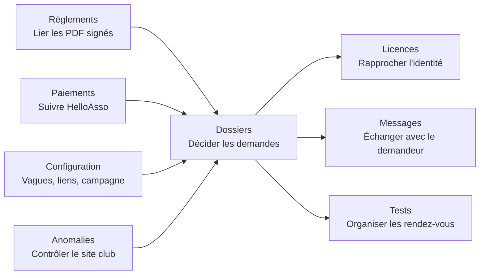

# Guide administrateur — onglets Abonnements escalade

Ce guide explique l'usage quotidien de l'espace
`/#/gestion-abonnements`. Il est destiné aux bénévoles possédant la tuile
**Abonnements escalade**. Cette tuile est indispensable, même pour une personne
ayant le rôle général « admin ».

> Les informations affichées par les onglets proviennent en partie du site du
> club, de l'annuaire des licences et de HelloAsso. Une information externe peut
> donc être absente ou ancienne tant qu'elle n'a pas été synchronisée.

## Vue d'ensemble

### État des synchronisations

Un encart placé au-dessus des onglets donne une vue commune des quatre sources
de campagne : **HelloAsso**, **site du club**, **annuaire des licences** et
**élèves des cours**. Pour chacune, il affiche la dernière réussite enregistrée
par le serveur — et non une simple tentative — ainsi que la prochaine
disponibilité des fenêtres automatique et manuelle.

La vérification automatique démarre à l'ouverture de l'administration. Le
bouton **Actualiser les sources disponibles** ne relance que les sources dont
le délai automatique est écoulé. Les relances manuelles gardent leur propre
fenêtre et restent placées dans l'onglet métier concerné : HelloAsso dans
**Paiements**, le site du club dans **Dossiers**, l'annuaire dans **Licences** ;
les élèves sont inclus dans le bouton du site du club. L'encart indique les
délais et l'heure exacte de la prochaine disponibilité de chaque action.

Après un changement de campagne, les sources concernées sont indiquées comme
**suspendues** jusqu'à leur réactivation dans **Configuration**. Le reset efface
les marqueurs de synchronisation propres à la campagne afin de permettre un
premier import immédiat après cette réactivation ; l'annuaire des licences et
son marqueur sont conservés, car ce cache est transversal aux campagnes.

Les règlements et scans stockés dans **Drive** sont hors du périmètre de cet
encart : leur synchronisation et leur suivi restent dans les onglets dédiés.

| Zone | But principal | Fréquence conseillée |
|---|---|---|
| Dossiers | Examiner et décider les demandes | À chaque nouvelle demande / quotidien en période d'ouverture |
| Messages | Répondre au demandeur depuis son dossier | Dès qu'un badge de message non lu apparaît |
| Paiements | Suivre les paiements du formulaire HelloAsso | Régulièrement après ouverture du paiement |
| Anomalies | Détecter les inscriptions directes non autorisées sur le site club | Après chaque synchronisation du site club |
| Licences | Rattacher chaque demande à la bonne licence | Avant ou pendant l'instruction des dossiers |
| Tests | Proposer et suivre les rendez-vous de test d'autonomie | Avant et pendant les sessions de test |
| Règlements | Lier les PDF signés aux licences puis suivre leur saisie sur le site du club | Quand un nouveau PDF est relevé ou qu'un badge apparaît |
| Configuration | Préparer la campagne et ses liens | Au début de campagne ; reset uniquement en fin de campagne |

## 1. Dossiers

### À quoi sert cet onglet ?

**Dossiers** est le poste de pilotage des demandes. Un dossier est lié à une
adresse e-mail et peut contenir plusieurs personnes (par exemple une famille).
Les décisions se prennent **personne par personne**, et non seulement pour le
dossier entier.

En haut de l'écran se trouvent :

- une jauge du nombre de places, fondée sur le dernier snapshot synchronisé du
  site club ;
- le bouton **Synchroniser le site club**, qui importe l'état actuel des
  abonnés et des élèves en cours ;
- un filtre par statut et une recherche par nom ou e-mail.

### Lire une carte dossier

Chaque carte montre le statut global, l'e-mail, la date de soumission, le
commentaire éventuel et les personnes de la demande.

- Le badge `💬` indique le nombre de messages non lus du demandeur.
- Le badge « en cours d'escalade » indique qu'une personne est reconnue dans
  l'export des cours ; c'est pertinent pour la priorité de vague 2.
- Cliquer le nom d'une personne ouvre son détail : licence, progression sur les
  étapes (licence, site, paiement, test…) et messagerie.

### Décider une demande

Pour chaque personne, utiliser l'un des boutons :

| Décision | Effet |
|---|---|
| **Valider** | Tant que l'occupation est sous le plafond, la personne accède à son parcours de finalisation et, si nécessaire, réserve un test. Si l'occupation est déjà au plafond, cette tentative devient automatiquement une **liste d'attente**. |
| **Valider malgré le plafond** | Exception volontaire réservée à l'admin Abonnements : valide la personne même si l'occupation est déjà au plafond. |
| **Liste d'attente** | Choix manuel toujours disponible : la personne reste en attente et n'accède pas à la finalisation comme une personne validée. |
| **Refuser** | La demande de cette personne est refusée. |

Le statut du dossier est calculé à partir de ses personnes. Un même dossier
peut donc contenir des situations différentes. Le plafond est contrôlé dans la
transaction serveur qui enregistre la décision : une validation normale peut
amener l'occupation exactement au plafond, mais jamais le dépasser. Deux actions
concurrentes ne peuvent donc pas attribuer la même dernière place. Les
informations de licence restent à vérifier avant de décider.

Les décisions portent d'abord sur la personne concernée. L'e-mail de statut est
ensuite piloté par le **statut global du dossier** : il est planifié seulement si
ce statut bascule. Par exemple, si un dossier multi-personnes est déjà globalement
validé, mettre automatiquement une autre personne en liste d'attente actualise
son statut individuel, mais ne garantit pas l'envoi d'un e-mail de liste
d'attente.

### Demandes supprimées

La section repliable **Demandes supprimées** est un historique léger des
dossiers retirés par leur demandeur. Elle donne une date, les personnes et
l'e-mail, mais ne permet pas de restaurer le dossier.

### Bon réflexe

Après une synchronisation réussie, traiter d'abord les nouveaux dossiers et
les messages non lus ; puis passer les personnes ambiguës par l'onglet
**Licences** avant de prendre une décision définitive.

Dans la file **Nouvelles demandes**, l'ordre utile est celui de chaque
personne encore en attente : la plus ancienne demande est affichée en premier,
même lorsqu'une personne a été ajoutée plus tard à un dossier plus ancien. La
date et l'heure affichées sur la carte indiquent donc concrètement qui traiter
ensuite.

## 2. Messages

### À quoi sert cet onglet ?

L'onglet **Messages** est la boîte de réception partagée des bénévoles. Le
badge placé à côté de son nom dans la barre d'onglets donne le total des
messages non lus. Par défaut, l'écran montre uniquement les conversations
**À traiter** ; le bouton **Toutes les conversations** élargit la liste.

Le fil est partagé entre le demandeur et tous les admins Abonnements. Il est
attaché au **dossier** et non à une personne : un message est donc commun à
tous les candidats d'un même dossier. Il reste également consultable depuis le
détail d'une personne dans l'onglet **Dossiers**.

### Utilisation

1. Ouvrir l'onglet **Messages**, puis cliquer **Voir et répondre** sur une
   conversation.
2. Lire le fil ; son ouverture marque les messages comme lus côté admin.
3. Saisir la réponse et cliquer **Envoyer**. `Ctrl + Entrée` (ou `Cmd + Entrée`
   sur macOS) envoie également le message.
4. Le demandeur voit la réponse en temps réel dans son portail.

Les e-mails transactionnels liés aux Abonnements ne reçoivent pas les réponses
par e-mail. Ils orientent explicitement le demandeur vers cette messagerie :
pour une question ou une réponse, traiter le fil du dossier plutôt que la boîte
d'envoi de l'association.

### À utiliser pour

- demander une précision sur une licence ou une identité ;
- expliquer une liste d'attente ou un refus ;
- rappeler une démarche manquante ;
- prévenir d'un changement de rendez-vous.

Éviter d'y communiquer des données inutiles ou sensibles. Le fil est conservé
avec le dossier jusqu'à sa suppression ou au reset de campagne.

## 3. Paiements

### À quoi sert cet onglet ?

Il affiche le **cache du formulaire HelloAsso dédié aux abonnements**. Il ne
concerne ni les paiements de cours ni un autre formulaire du club.

Si aucun formulaire n'est lié, l'onglet demande de coller l'URL publique
HelloAsso. Après l'enregistrement, il faut lancer une synchronisation pour voir
les paiements remontés.

### Actions disponibles

- **Synchroniser maintenant** : actualise le cache HelloAsso du formulaire
  Abonnements.
- Filtrer par statut, rechercher un nom/e-mail, ou n'afficher que les problèmes
  de remboursement.
- Ouvrir le reçu et le reçu fiscal lorsqu'ils sont disponibles.
- **Rembourser** : copie l'e-mail du payeur quand possible, puis ouvre l'espace
  HelloAsso ; le remboursement est réalisé dans HelloAsso, pas dans cette
  application.
- Poser un statut de suivi interne : `à traiter`, `traité`, `en attente` ou
  `remboursé`, avec un commentaire si nécessaire.

### Point fondamental

Le statut posé dans cet onglet est un **suivi interne de l'équipe**. Il ne
modifie pas l'étape officielle de paiement affichée au demandeur ; celle-ci est
alimentée par les données du site du club après synchronisation. Ne pas
interpréter « traité » comme une validation automatique de l'abonnement.

## 4. Anomalies

### À quoi sert cet onglet ?

**Anomalies** est une liste de contrôle, en lecture seule. Elle affiche
uniquement les inscriptions du dernier snapshot du site club qui ne respectent
pas les règles d'inscription. Une inscription conforme n'apparaît donc pas
dans cet onglet. Le portail ne modifie jamais ce site : si une inscription doit
disparaître, le staff la retire manuellement sur le site du club puis relance
la synchronisation.

Chaque ligne indique le statut de la demande portail et l'action attendue. La
présence parmi les élèves en cours est utile au dépôt en vague 2, mais ne rend
jamais conforme une inscription déjà présente sur le site.

Une inscription site est **validée** seulement si la personne est :

- un abonné validé N-1, rapproché sans ambiguïté par nom et prénom ;
- ou titulaire d'une demande portail validée.

Une demande trouvée mais en attente, en liste d'attente ou refusée donne une
**anomalie**. Les inscriptions déjà marquées **Bloqué** sur le site ne figurent
pas dans cette liste.

Le statut **Inconnu** signale une ancienne donnée qui disait seulement « pas
Oui », sans permettre de distinguer `Non` de `Bloqué`. Elle est exclue de la
jauge jusqu'à une nouvelle synchronisation du site et doit être traitée en
priorité avant l'ouverture de la campagne.

### Que faire d'une anomalie ?

1. Vérifier le nom, la licence et la raison affichée.
2. Vérifier si les données ont été synchronisées récemment ; un décalage peut
   expliquer une anomalie temporaire.
3. Si elle est confirmée, **rejeter l'inscription directement sur le site du
   club**. Cet onglet ne modifie aucune inscription externe.
4. Si elle correspond à une personne qui devrait être admise, corriger le canal
   manquant : dossier à valider, licence à rapprocher ou vague à ouvrir.

Les anomalies restent visibles tant que l'inscription existe sur le site. Un
statut `Non` figure dans le total affiché, mais n'occupe pas automatiquement le
plafond qui bloque la validation d'une demande. Les statuts `Inconnu` et
`Bloqué` sont exclus de ce total.

## 5. Licences

### À quoi sert cet onglet ?

La licence est la clé de rapprochement entre une demande, le site du club et
les exports de cours. L'onglet montre les personnes dont la licence n'a pas pu
être reliée avec certitude.

Les correspondances exactes de nom/prénom — y compris dans l'ordre inversé —
sont résolues automatiquement. Les cas restants exigent un arbitrage humain.

### Procédure conseillée

1. Cliquer **Synchroniser l'annuaire des licences** si l'annuaire peut avoir
   changé ou si c'est le début de journée de traitement. L'import est limité à
   deux passages sur 24 heures : le bouton indique l'heure de disponibilité si
   l'annuaire a déjà été actualisé au cours des 12 dernières heures.
2. Cliquer **Relancer la résolution automatique** : cela peut résoudre les
   nouveaux cas exacts.
3. Pour chaque personne restante, examiner les candidats proposés et leur
   pourcentage de similarité.
4. Cliquer **Associer** uniquement lorsque l'identité est certaine ; sinon,
   saisir manuellement le numéro de licence à 12 chiffres puis associer.

> Ne jamais associer une licence sur la seule ressemblance d'un nom. Une erreur
> fausse le suivi de la licence, de l'inscription et potentiellement le
> rapprochement avec le site du club.

L'annuaire affiché est le dernier snapshot FFCAM réussi : une licence qui n'y
figure plus est retirée du cache de recherche, sans retirer la licence déjà
associée à une personne ni supprimer son dossier.

### Conflit de licence

Si une licence est déjà affectée à une autre personne, l'association est
arrêtée. Le conflit est proposé immédiatement pendant l'association et reste
aussi visible dans la liste **Conflits de licence** : il peut donc être repris
plus tard sans recommencer la recherche.

La résolution s'effectue dans un seul écran :

1. vérifier les deux e-mails, qui représentent les deux dossiers ;
2. choisir **Conserver les deux dossiers**, **Conserver seulement le dossier A**
   ou **Conserver seulement le dossier B** ;
3. si les deux restent, choisir le dossier de chaque personne. L'écran affiche
   uniquement son nom, son prénom et sa licence ;
4. vérifier que chaque dossier conservé contient au moins une personne et
   qu'aucune personne n'est sans dossier ;
5. confirmer la répartition. En cas de suppression, retaper l'e-mail du dossier
   supprimé.

La personne portant la licence en doublon n'existe qu'une fois après la
résolution. Les autres informations sont retrouvées par la licence lors du
rapprochement avec le snapshot du site du club : elles ne sont pas mélangées ni
arbitrées dans cet écran.

Si les deux dossiers restent, leurs comptes, messages et historiques restent
séparés. Si un dossier est supprimé, son ancien accès public est désactivé. Une
ancre technique inactive reste jusqu'à la remise à zéro annuelle afin que la
demande de code ne permette pas de détecter l'existence d'une résolution. Une
tentative de connexion Abonnements avec son ancienne adresse est ensuite
refusée par un message générique :
elle ne révèle pas l'e-mail du dossier conservé et ne connecte jamais directement à
l'autre compte. L'adresse à utiliser figure dans l'email de résolution envoyé à
l'ancienne boîte. Ce repère ne vaut que pour la campagne en cours et disparaît
lors de la remise à zéro. Si le
compte écarté appartient aussi à un membre du staff, il est au contraire
conservé avec ses accès staff ; seule son ancienne séparation côté Abonnements
disparaît.

Une notification est préparée pour chacune des deux adresses. Lorsque les deux
dossiers restent, chaque adresse reçoit seulement la composition finale de son
propre dossier. Lorsqu'un dossier disparaît, son adresse reçoit l'adresse à
utiliser et l'adresse conservée reçoit sa composition finale.
La confirmation indique que
les deux notifications sont planifiées. Un éventuel échec est conservé dans le
suivi interne ; il n'existe pas d'action de relance dans l'écran admin.

> La résolution ne touche jamais le site du club. Elle n'y modifie, n'y supprime et
> n'y bloque aucune inscription. Toute correction nécessaire sur ce site reste
> une action manuelle distincte.

## 6. Tests

### À quoi sert cet onglet ?

L'onglet **Tests** organise les rendez-vous de test d'autonomie. Chaque
encadrant y déclare ses propres disponibilités ; les candidats réservent ensuite
des tranches calculées automatiquement à partir de l'ensemble des encadrants.

Une personne dont la demande a été **validée** peut réserver, même si sa
licence, son âge ou son besoin de test ne sont pas encore connus. Le rendez-vous
est alors affiché comme **provisoire**. Cette réservation reste possible hors
saison : elle ne dépend pas de l'ouverture d'une vague.

### Proposer une disponibilité

1. Choisir un jour, aujourd'hui ou dans le futur.
2. Dans la grille, cliquer une heure de début puis une heure de fin.
3. Vérifier le résumé et cliquer **Ajouter le créneau**.

Les limites appliquées sont : horaires alignés sur 20 minutes (`00`, `20`,
`40`), fin après début et durée minimale de 40 minutes. L'interface propose une
grille de 08:00 à 22:40.

Chaque encadrant apporte deux places par tranche de 20 minutes. Lorsque des
disponibilités se chevauchent, la capacité se cumule. Les candidats voient des
rendez-vous de 60 minutes en priorité, puis de 40 minutes, sans connaître
l'identité de l'encadrant.

### Mes créneaux et inscrits

- **Mes créneaux** : seuls vos créneaux y apparaissent. Vous pouvez supprimer
  uniquement ceux que vous avez créés.
- **Inscrits par créneau** : tous les admins Abonnements voient les rendez-vous
  actifs, avec le nom, le prénom et l'e-mail des candidats.

Avant de supprimer un créneau, tenir compte de l'avertissement : si la capacité
devient insuffisante, les derniers inscrits sont annulés en premier. Ils sont
invités à reprendre rendez-vous et un e-mail d'annulation est planifié.

### Confirmer ou annuler un RDV provisoire

La vérification se fait après une synchronisation du site du club. Pour protéger
les personnes portant des noms proches, le portail ne réévalue un RDV que si la
**licence correspond exactement** ; une similitude de nom ou de prénom ne suffit
jamais.

- Si les informations synchronisées confirment qu'un test est requis et que la
  personne a au moins 16 ans, le RDV devient **confirmé**.
- Si elles indiquent que le test n'est pas requis, qu'il est déjà validé, ou que
  la personne a moins de 16 ans, le RDV est annulé et le demandeur reçoit une
  explication.
- Si la licence, l'âge ou le besoin de test restent inconnus, le RDV demeure
  provisoire jusqu'au jour du rendez-vous. Ne l'annulez pas sur une supposition.

Chaque réservation active reçoit un rappel à J-1 ; si le créneau est à moins de
24 heures au moment de la réservation, le rappel est envoyé immédiatement. Son
objet mentionne le test d'autonomie et demande d'imprimer le formulaire. Le
demandeur le télécharge depuis son espace sécurisé : aucun formulaire n'est joint
à l'e-mail. Les rappels sont programmés individuellement avec chaque
réservation ; aucun cron périodique n'est utilisé.

### Enregistrer et traiter un test

Après un rendez-vous, ouvrez la liste des candidats ayant réservé un créneau
passé, puis cliquez sur **Enregistrer le test**. Prenez ou choisissez une seule
photo du formulaire rempli et validez l'envoi. Le scan est rangé dans le même
répertoire Google Drive historique que les anciens tests, avec le nom
`NOM Prénom`.

Si la personne n'apparaît pas dans la liste, utilisez **Rechercher un candidat**
et saisissez son numéro de licence. Cette recherche ne charge pas l'annuaire
complet : elle sert uniquement à retrouver la personne demandée.

La liste **Tests déposés sur Drive** rassemble les scans récemment enregistrés.
Ouvrez le test, validez son résultat sur le site du club, puis cliquez sur
**Marquer comme traité** dans le portail. Ce statut est un repère interne ; il
ne modifie pas le résultat du test dans le portail ni sur le site du club. Au
changement de campagne, cette liste et ses statuts sont vidés dans le portail ;
les scans restent dans Drive et s'y recherchent avec l'identité de la personne.

## 7. Règlements

### À quoi sert cet onglet ?

L'onglet **Règlements** relie un PDF signé dans DocuSeal à la bonne licence,
puis suit son enregistrement manuel sur le site du club. Le badge de l'onglet
compte les règlements déjà liés qui restent à enregistrer sur ce site.

La signature seule ne valide pas l'étape affichée au demandeur : elle passe à
**Fait** seulement après confirmation de la liaison par un membre du staff. Un
délai entre la signature et cette confirmation est donc normal.

### Retrouver et lier un règlement

1. Ouvrir l'onglet : la synchronisation se lance automatiquement. Le bouton
   **Synchroniser les règlements** permet de la relancer immédiatement. Le
   portail reçoit de n8n les PDF déjà classés dans Drive.
2. Dans **Nouveaux règlements à rapprocher**, ouvrir le PDF proposé et vérifier
   l'identité extraite.
3. Contrôler les correspondances exactes ou probables proposées, puis choisir
   la bonne licence. Si elle n'apparaît pas, rechercher avec un nom, un prénom
   ou quelques lettres. Le nom reste un indice : aucune liaison n'est automatique.
4. Cliquer **Confirmer la liaison avec cette licence** et confirmer. Le fichier
   Drive devient alors l'archive signée de cette licence. Un même PDF ne peut pas être réutilisé,
   et une licence ne peut recevoir qu'un règlement pour la version courante
   `6GFLQa478G3Qwv`.

La synchronisation est légère et idempotente : elle peut être relancée sans
délai et ne crée pas de doublon. Aucun cron ne fonctionne lorsque personne
n'utilise l'administration. La recherche Drive manuelle reste disponible pour
retrouver un ancien PDF déjà classé. Une panne du webhook est affichée
immédiatement sans créer de faux règlement.

### Enregistrer sur le site du club

1. Dans **À enregistrer**, cliquer **Ouvrir le règlement dans Drive**.
2. Enregistrer manuellement le règlement sur le site internet du club.
3. Revenir dans le portail et cliquer **Marquer enregistré sur le site**, puis
   confirmer. La ligne rejoint **Enregistrés**.

Le bouton met uniquement à jour la file de travail interne. Il ne transmet
rien au site du club. Au changement de campagne, cette file, ses liaisons et
ses états de traitement sont supprimés du portail ; le PDF reste dans Drive et
peut y être recherché si un document d'une campagne précédente est nécessaire.

## 8. Configuration

Cet onglet modifie les paramètres communs à toute la campagne. Il doit être
réservé à un petit nombre de responsables ; les changements prennent effet pour
tous les admins et demandeurs concernés.

### Synchronisations externes

Après le changement de campagne, les imports de campagne Abonnements passent
automatiquement à **en pause** : site du club, annuaire des licences et import
des élèves utilisé par les vagues. Cette pause évite de réimporter les
informations de la campagne précédente, notamment des élèves qui ne sont plus
« en cours ». Elle ne bloque pas les autres tuiles qui utilisent aussi le
snapshot des élèves. Une fois chaque source basculée sur la nouvelle campagne,
cliquer sur
**Réactiver les synchronisations**, puis lancer les synchronisations habituelles.

### Plafond de places

Le plafond alimente la jauge « X / plafond » et sécurise les décisions de
validation. Une validation normale reste possible jusqu'au plafond inclus : elle
peut prendre la dernière place. Si l'occupation est déjà au plafond, cliquer
**Valider** transforme automatiquement la décision en **liste d'attente**.

Pour admettre exceptionnellement une personne au-delà du plafond, l'admin
Abonnements doit choisir **Valider malgré le plafond**. Ce choix n'est jamais
implicite. Les décisions manuelles **Liste d'attente** et **Refuser** restent
possibles quel que soit le niveau d'occupation. Elles actualisent le statut
individuel ; l'e-mail de statut n'est planifié que si le statut global du dossier
change.

L'occupation est calculée depuis le snapshot synchronisé du site club. Elle peut
donc être périmée si une inscription ou une annulation externe n'a pas encore
été synchronisée. Avant une décision sensible, utiliser **Synchroniser le site
club** et vérifier que l'actualisation a réussi.

### Liens des étapes d'inscription

Ces URL sont affichées à un demandeur validé dans son suivi : nouvelle licence,
renouvellement, activation de compte, demande d'abonnement sur le site du club
et formulaire de test. Le règlement est un lien DocuSeal versionné dans le
code ; il n'est pas modifiable dans cet écran.

Vérifier les liens dans un navigateur avant enregistrement. Le lien HelloAsso
de paiement est séparé : il est défini pour la campagne et ne se modifie qu'au
changement de saison.

Tous les liens doivent utiliser HTTPS. Le lien d'inscription au créneau
autonome, utilisé notamment pour rediriger les abonnés N-1, doit en plus rester
sur `caflarochebonneville.fr` ou l'un de ses sous-domaines. Le portail refuse
son enregistrement sur un domaine tiers.

### Dates des vagues

Les heures sont interprétées en heure de Paris.

| Vague | Public admis à déposer une demande via le portail |
|---|---|
| Vague 1 | Pas de demande dans le portail : les abonnés N-1 se réinscrivent directement sur le site du club. |
| Vague 2 | Élèves actuellement inscrits aux cours d'escalade, reconnus avec leur licence. |
| Vague 3 | Tout le monde. |

Laisser une date vide garde la vague fermée. La vague 2 doit impérativement
être antérieure à la vague 3. Ces dates sont à ressaisir à chaque campagne.

### Changer de saison — action irréversible

Cette opération doit être lancée **avant le premier scraping de la nouvelle
saison**, après validation de la conservation des données et du nouveau lien
HelloAsso. Elle :

- archive le snapshot actuel des abonnés en N-1 ;
- vide les snapshots, créneaux, réservations, cache de paiements, journal
  d'e-mails et toutes les autres files de suivi de la campagne ;
- vide les archives Convex des tests d'autonomie et règlements, ainsi que les
  fusions et leurs notifications ; les scans et PDF restent dans Drive, où ils
  peuvent être recherchés ;
- programme la suppression des demandes et comptes publics ;
- conserve le compte, les sessions et l'authentification d'un staff qui a aussi
  utilisé le portail public, tout en purgeant ses données publiques de campagne ;
- enregistre le nouveau lien HelloAsso et efface les dates de vagues.

`abo_licences` reste le cache courant de l'annuaire et n'est pas un historique
annuel. L'archive des abonnés est, elle, remplacée par le seul snapshot N-1.

> **Autorisation requise :** ne lancer le reset que lorsque les
> responsabilités de fin de campagne ont été validées. Le bouton n'est
> accessible qu'à l'administrateur général disposant à la fois de la tuile
> Abonnements et de l'autorisation nominative de reset, réglée dans
> **Configurations > Utilisateurs et Accès**.
> Avant le premier reset réel, répéter néanmoins l'opération sur une copie de
> données représentative et vérifier les deux cas : compte public pur et compte
> staff ayant aussi déposé une demande. Voir
> [l'audit complet](10-audit-abonnements-escalade.md).

Après le reset, reconfigurer les vagues et contrôler les liens. Attendre que les
sources utilisées par Abonnements aient basculé sur la nouvelle campagne, puis
cliquer sur **Réactiver les synchronisations** avant de les lancer et de rouvrir
la campagne.

## Routine opérationnelle minimale

### Règles de campagne

Le portail est strictement **en lecture seule** vis-à-vis du site du club : il
lit le snapshot synchronisé, ne modifie jamais une inscription externe et ne
la retire jamais. Lorsqu'une ligne est à vérifier, le staff agit manuellement
sur le site du club puis synchronise le portail.

Une personne reconnue N-1 est redirigée vers le site du club ; une
correspondance ambiguë ne donne jamais un droit automatique. En vague 2, seule
une licence présente dans l'export des élèves en cours permet le dépôt. Cette
condition ne valide pas une inscription déjà présente sur le site. Les vagues
organisent seulement la priorité de dépôt : le staff peut décider normalement
une demande déposée pendant une vague précédente, même après la vague 3.

Un même compte peut vérifier au maximum 20 personnes en 10 minutes. Cette
limite freine les recherches répétées ; un abonné qui l'atteint doit simplement
patienter avant de reprendre son dossier.

Une personne déjà liée à une inscription du site ne peut pas être retirée du
dossier portail. Retirez d'abord l'inscription sur le site, puis synchronisez.

1. Synchroniser le site du club, puis lire Dossiers et Anomalies.
2. Répondre aux messages non lus.
3. Résoudre les licences ambiguës avant validation.
4. Décider pour chaque personne : valider jusqu'au plafond, utiliser la liste
   d'attente ou le refus lorsque c'est le choix métier, et réserver « Valider
   malgré le plafond » aux exceptions assumées. En cas de changement externe
   récent, synchroniser avant la décision.
5. Traiter le badge Règlements : rechercher les nouveaux PDF, valider chaque
   liaison licence, puis suivre leur enregistrement manuel sur le site du club.
6. Synchroniser et suivre les paiements séparément.
7. Vérifier que les créneaux de test couvrent les besoins et éviter leur
   suppression tardive.

Pour les règles de sécurité, la base de données et les limites connues, lire
aussi [l'audit fonctionnel complet](10-audit-abonnements-escalade.md).
